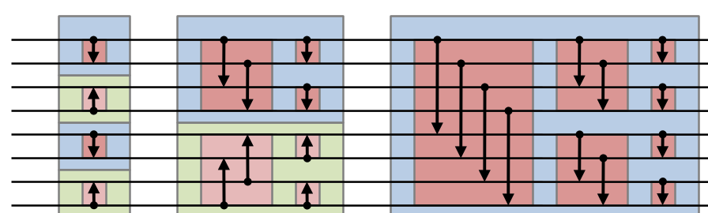

An example of verilog.

### Files
`basic.v`: 基本寫法  
`sort.v` : module 寫法  
`testbench.v` : 用來 test sort.v 是否正確  

### Discussion
Q: 花了幾個 cycle?  
    - stage 1: 1 個 cycle 後， sequential 才會 update 所有 reg

### Reference
https://en.wikipedia.org/wiki/Bitonic_sorter 